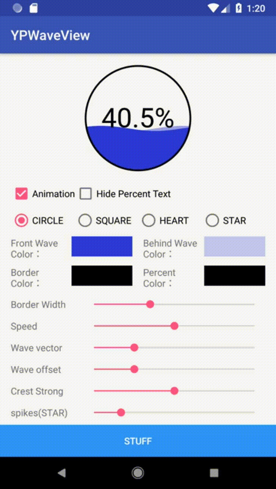
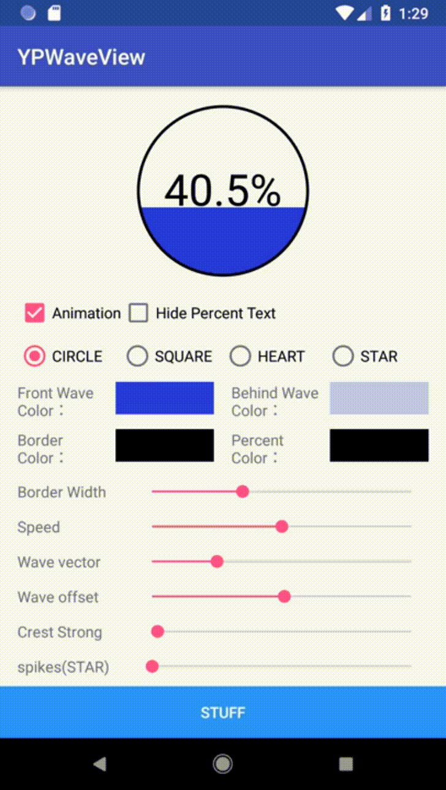
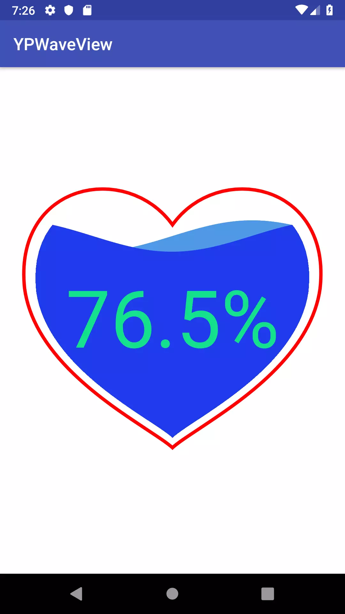

# YPWaveView<a href='https://play.google.com/store/apps/details?id=com.yangping.ypwaveview'></a>


A wave-like progressbar on Android which has four shapes, circle, square, heart and star.


Sample
======

 


Attributes
===
| Name | Format | Value  |
| :---:   | :-:  | :-: |
| max | Integer | Defines the maximum value.  |
| progress | Integer | Defines the default progress value, between 0 and max.   |
| frontColor | color | Defines the color of the front wave.   |
| behideColor | color | Defines the color of the behide wave.   |
| borderColor | color | Defines the color of the border.   |
| textColor | color | Defines the color of the percent text.   |
| borderWidthSize | Dimension | Defines the width of the border.   |
| strong | Integer | Defines the strong of the wave crest, between 0 and 100.|
| animatorEnable | boolean | Control the start of the animation. |
| shapeType | enum | Set the shape of the YPWaveView. (circle, square and heart)|
| textHidden | boolean | Set whether the percent text is hidden|
| shapePadding | Dimension | Defines the value of the shape padding.|

Methods
===

| Name | Return | Definition |
| :---:   | :-:  | :-:  |
| startAnimation() | void | Start the animation. |
| stopAnimation() | void | Stop the animation. |
| setWaveVector(float offset) | void | Set the vector of the wave, between 0 and 100. |
| setWaveOffset(int offset) | void | Set the offset of the front and behide waves, between 0 and 100.|
| setShape(Shape shape) | void | Set the shape of the YPWaveView.(YPWaveView.Shape)|
| setHideText(boolean hidden) | void | Set whether the percent text is hidden|
| setStarSpikes(int count) | void | Set the count of spikes.|
| setBorderWidth(float width) | void | Set the width of the border.|
| setShapePadding(float padding) | void | Set the value of the shape padding.|
| setWaveStrong(int strong) | void | Set the strong of the wave crest, between 0 and 100.|


XML
===



```
 <com.yangp.ypwaveview.YPWaveView
        android:layout_width="match_parent"
        android:layout_height="match_parent"
        app:animatorEnable="false"
        app:textHidden="false"
        app:shapeType="heart"
        app:frontColor="#1f3bed"
        app:behideColor="#4e99e6"
        app:borderColor="#ff0000"
        app:borderWidthSize="4dp"
        app:textColor="#15DF89"
        app:max="1000"
        app:progress="765"
        app:strong="100"
        app:shapePadding="30dp"/>
```

Download
========
```xml
<dependency>
  <groupId>com.yangping</groupId>
  <artifactId>ypwaveview</artifactId>
  <version>1.0.3</version>
  <type>pom</type>
</dependency>
```
or Gradle ( jcenter ):
```groovy
implementation 'com.yangping:ypwaveview:1.0.3'
```
### License
```
Copyright 2018 zih-yang lin

Licensed under the Apache License, Version 2.0 (the "License");
you may not use this file except in compliance with the License.
You may obtain a copy of the License at

   http://www.apache.org/licenses/LICENSE-2.0

Unless required by applicable law or agreed to in writing, software
distributed under the License is distributed on an "AS IS" BASIS,
WITHOUT WARRANTIES OR CONDITIONS OF ANY KIND, either express or implied.
See the License for the specific language governing permissions and
limitations under the License.
```
